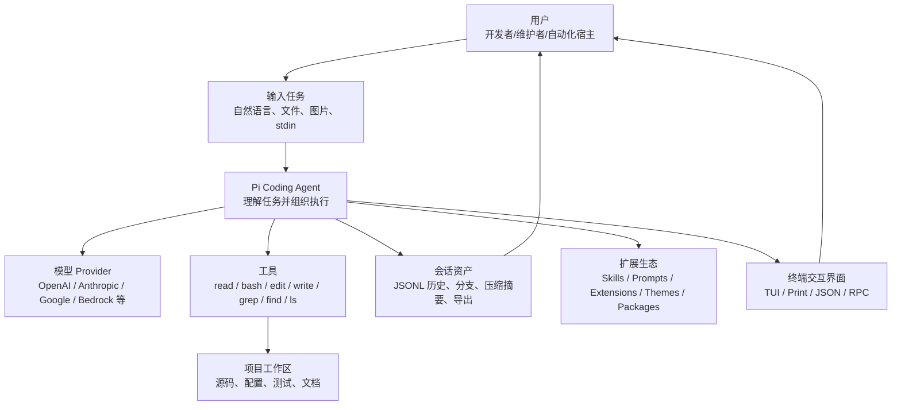
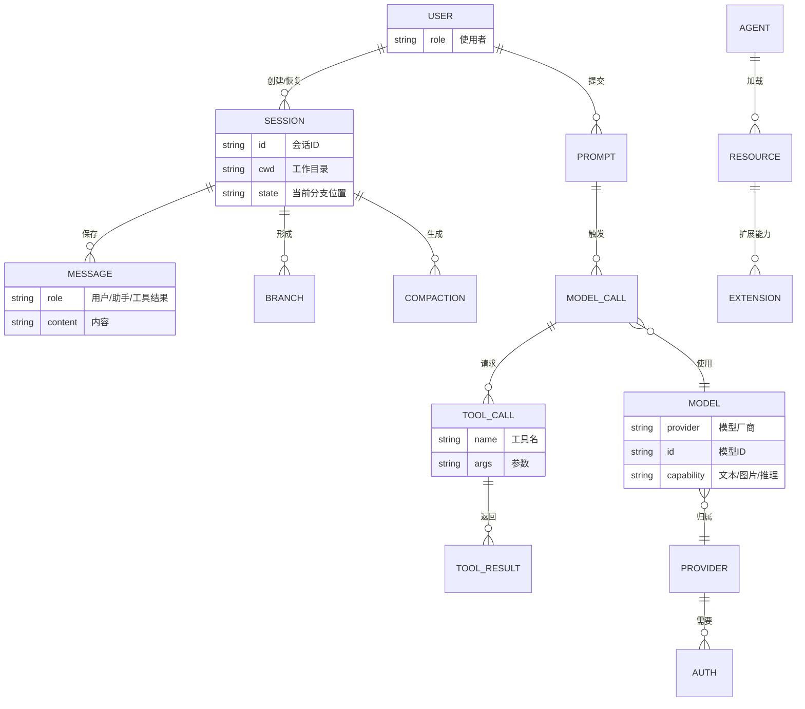
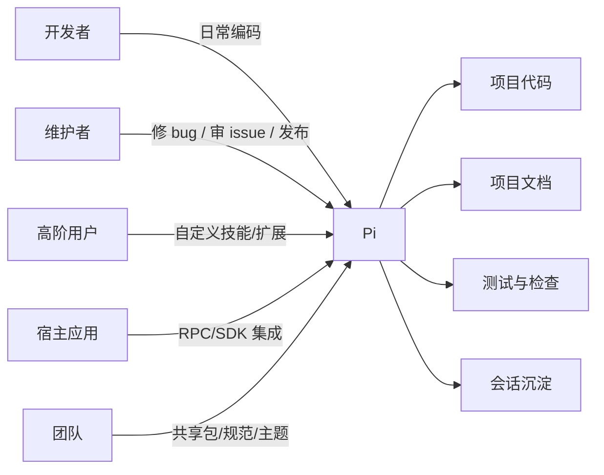
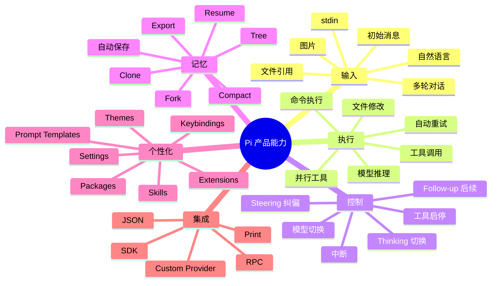
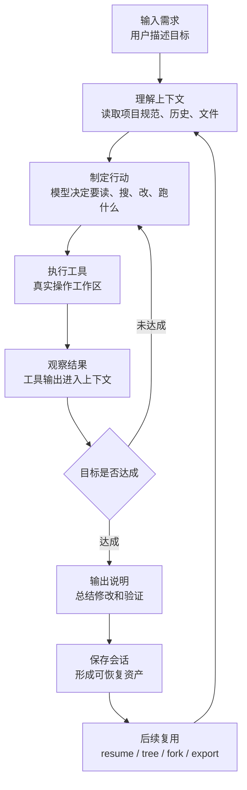
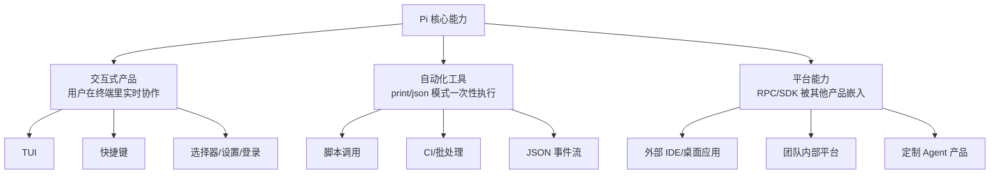
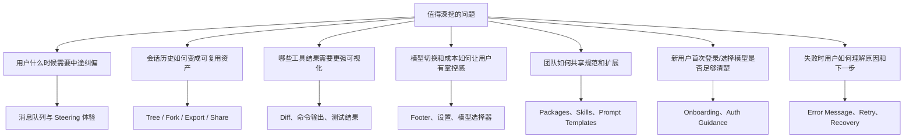
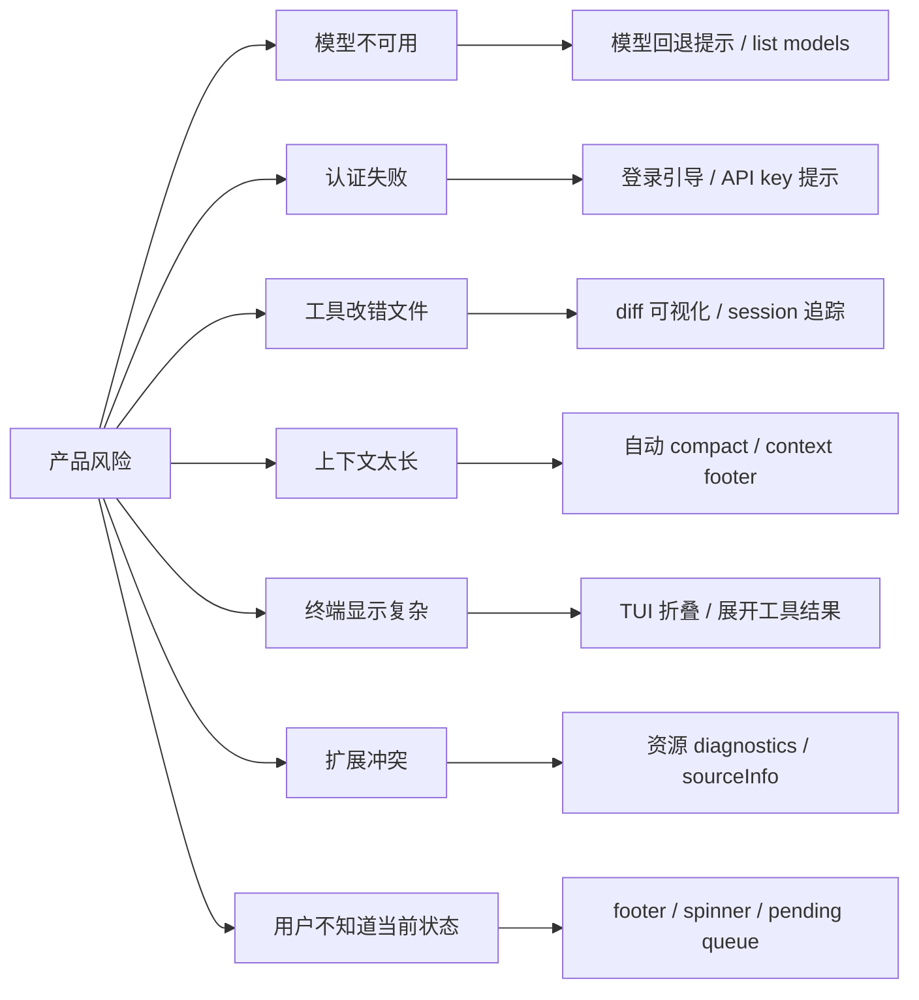

# 01 产品全景与业务对象

本文从产品视角解释 Pi 是什么、谁在使用它、系统里有哪些业务对象，以及这些对象如何形成一个完整的开发助手业务闭环。

## 1. 产品一句话

Pi 是一个运行在终端里的 coding agent。用户用自然语言描述开发任务，Pi 会选择模型、读取项目、运行工具、修改文件、执行命令，并把整个过程保存成可恢复的会话。

## 2. 核心业务对象

这些对象可以翻译成产品语言：

| 技术对象 | 产品语言 | 用户感知 |
| --- | --- | --- |
| Session | 一次工作记录 | “我上次让它做的事还能继续” |
| Message | 对话和行动日志 | “它刚才读了什么、改了什么、为什么失败” |
| Tool | Agent 的行动能力 | “它能看文件、改文件、跑命令” |
| Model | 思考引擎 | “我现在用哪个大模型帮我干活” |
| Provider | 模型服务来源 | “用 Anthropic、OpenAI 还是别的服务” |
| Resource | 个性化配置资源 | “这个项目有什么规范、技能、模板、主题” |
| Extension | 插件能力 | “这个团队可以给 Pi 加自己的工作流” |

## 3. 用户是谁

不同用户的核心诉求：

| 用户类型 | 想解决的问题 | Pi 对应能力 |
| --- | --- | --- |
| 普通开发者 | 快速完成一个代码任务 | interactive mode、内置工具、自动会话 |
| 项目维护者 | 处理 issue、回溯修改过程 | session tree、HTML export、share |
| 团队管理员 | 固化团队规范和工作流 | AGENTS.md、skills、prompt templates、packages |
| 高阶用户 | 增加自定义命令和工具 | extensions、custom provider、custom UI |
| 外部应用 | 把 Agent 嵌入产品 | RPC mode、SDK |

## 4. 产品能力地图

## 5. 业务闭环

Pi 的业务闭环可以看成“输入 -> 行动 -> 反馈 -> 沉淀 -> 再利用”。

产品上最重要的不是单次回答，而是这个闭环能持续运行。

## 6. 三类产品形态

## 7. 值得深挖的产品问题

## 8. 产品风险地图

## 9. 产品理解小结

Pi 的业务不是单一聊天，而是一个开发任务执行平台：

- 用户输入目标。
- 模型做决策。
- 工具执行真实动作。
- 会话记录全过程。
- 扩展和资源让团队定制工作方式。
- 多种运行模式让它既能当产品，也能当基础设施。

后续文档会分别展开这些业务线。
