# 02 用户旅程与模式选择

本文用产品经理视角解释用户从启动 Pi 到完成任务的完整旅程，以及系统如何在 interactive、print、JSON、RPC、SDK 之间选择不同产品形态。

## 1. 用户旅程总览

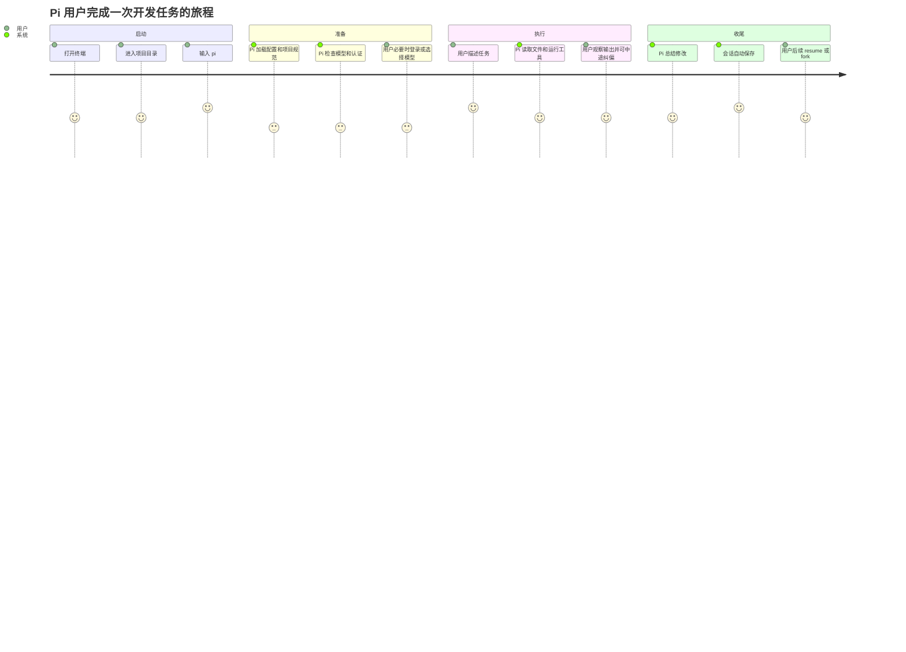

## 2. 启动时系统做了什么

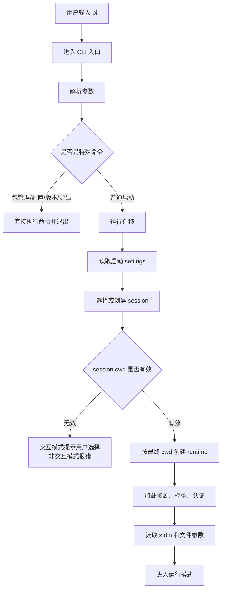

产品解释：

- Pi 不是一启动就问模型。
- 它先确认“在哪个项目工作”“用哪段历史”“有什么规则”“能不能调用模型”。
- 这些准备决定后面任务是否顺畅。

## 3. 模式选择逻辑

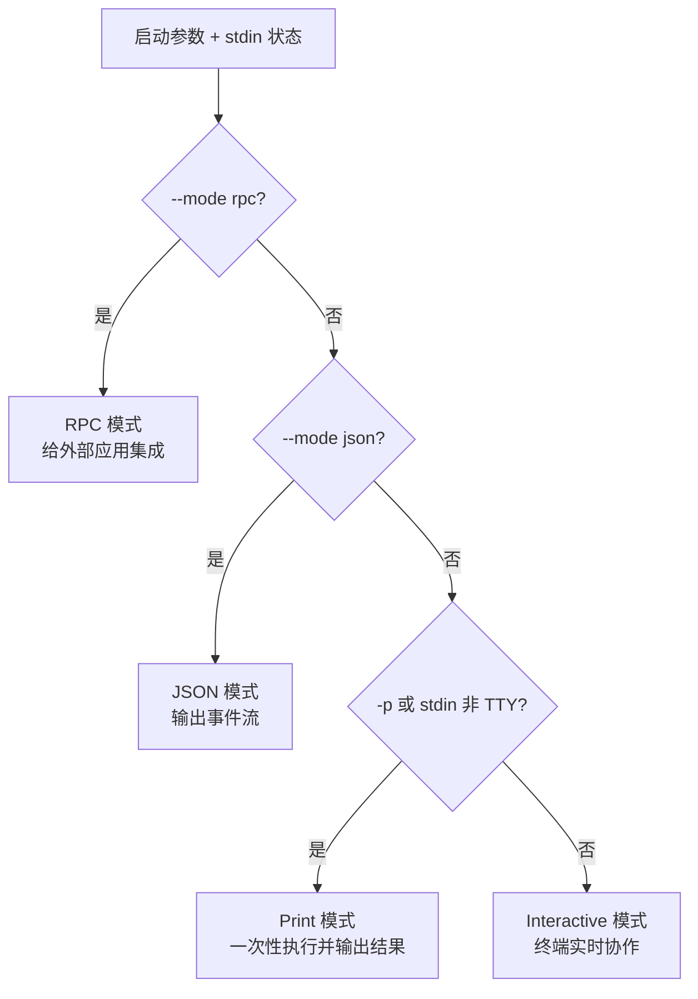

同一个核心能力，会包装成不同产品形态：

| 模式 | 用户是谁 | 典型场景 | 输出 |
| --- | --- | --- | --- |
| Interactive | 终端用户 | 日常开发协作 | TUI 界面 |
| Print | 脚本用户 | 一次性问答或批处理 | 最终文本 |
| JSON | 自动化用户 | 需要机器读取事件 | JSON 行 |
| RPC | 宿主产品 | IDE/桌面应用/平台集成 | 双向 JSONL |
| SDK | 开发者 | 直接嵌入应用 | 程序 API |

## 4. 首次使用旅程

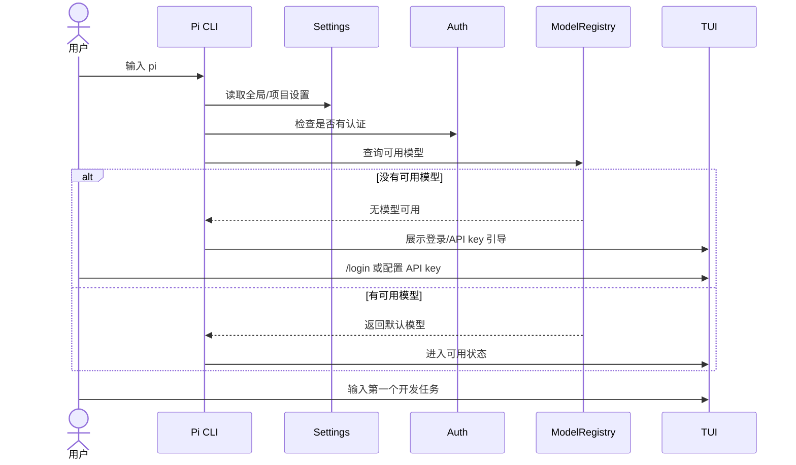

首次使用的关键产品点：

- 用户最怕“不知道为什么不能用”。
- 所以认证失败、无模型、模型恢复失败都需要清楚提示。
- `/login`、`/model`、`/settings` 是首次体验里的关键入口。

## 5. 日常开发旅程

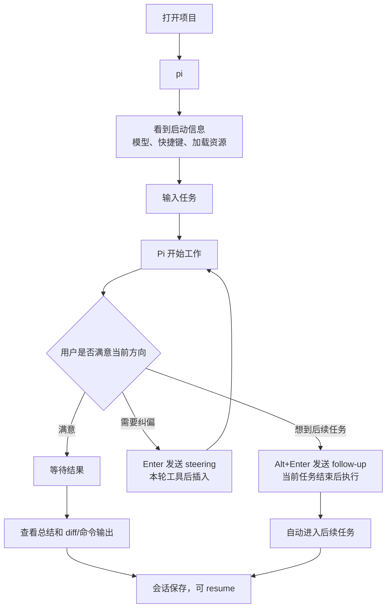

这里的产品亮点是：用户不需要等模型完全结束才能表达新想法。

## 6. 消息队列体验

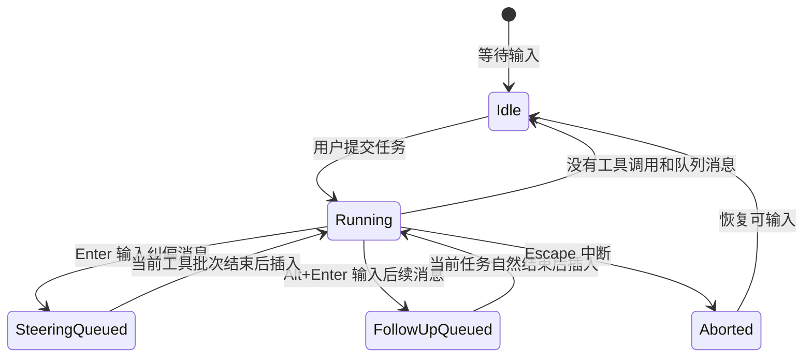

产品解释：

- Steering 是“现在方向不对，下一步先听我这句”。
- Follow-up 是“你先把当前事做完，之后再做这个”。
- 这是 Pi 相比普通一次性命令的重要体验差异。

## 7. 恢复历史旅程

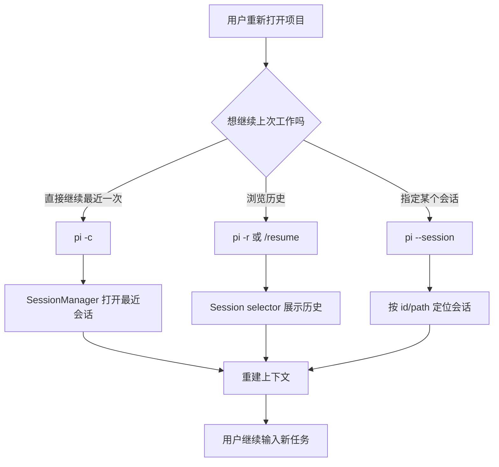

值得挖掘的体验问题：

- session 列表如何帮助用户找到“那次工作”？
- 是否需要按项目、时间、模型、首条消息、标签筛选？
- 恢复后是否应该更明显地告诉用户当前处在哪个历史分支？

## 8. 分支探索旅程

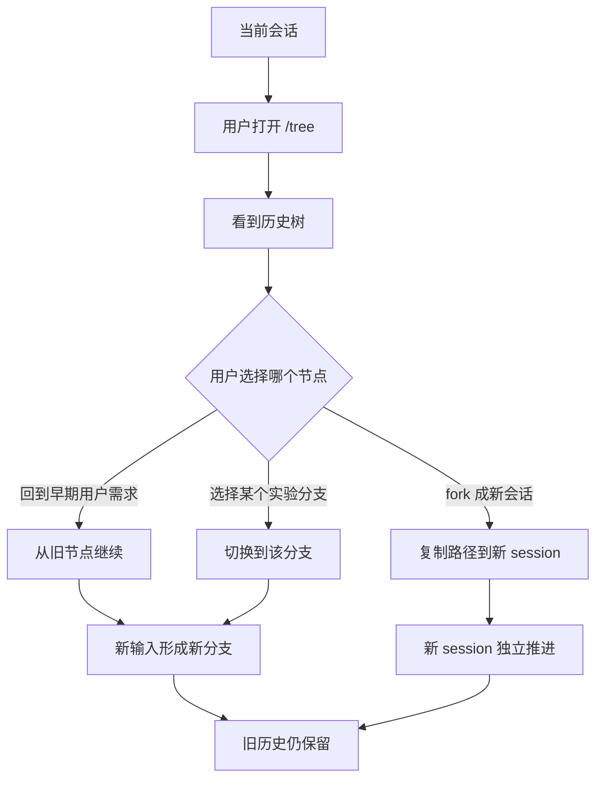

这对产品的意义：

- Pi 不只是线性聊天。
- 它支持“回到过去重新试一条路”。
- 适合探索式开发，比如“方案 A 不行，回到前面试方案 B”。

## 9. 登录和模型选择旅程

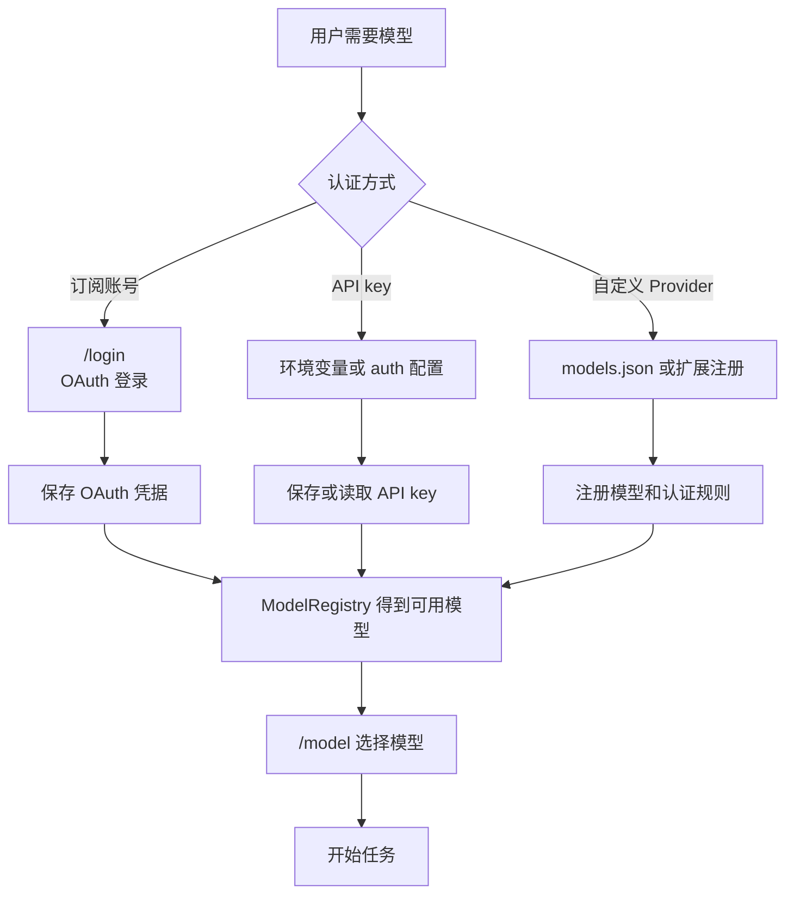

产品上需要解释清楚：

- “登录”不等于所有 Provider 都可用。
- 不同 Provider 有不同认证来源。
- 模型选择应显示 provider、能力、thinking 支持、上下文、成本等关键差异。

## 10. 用户可感知状态

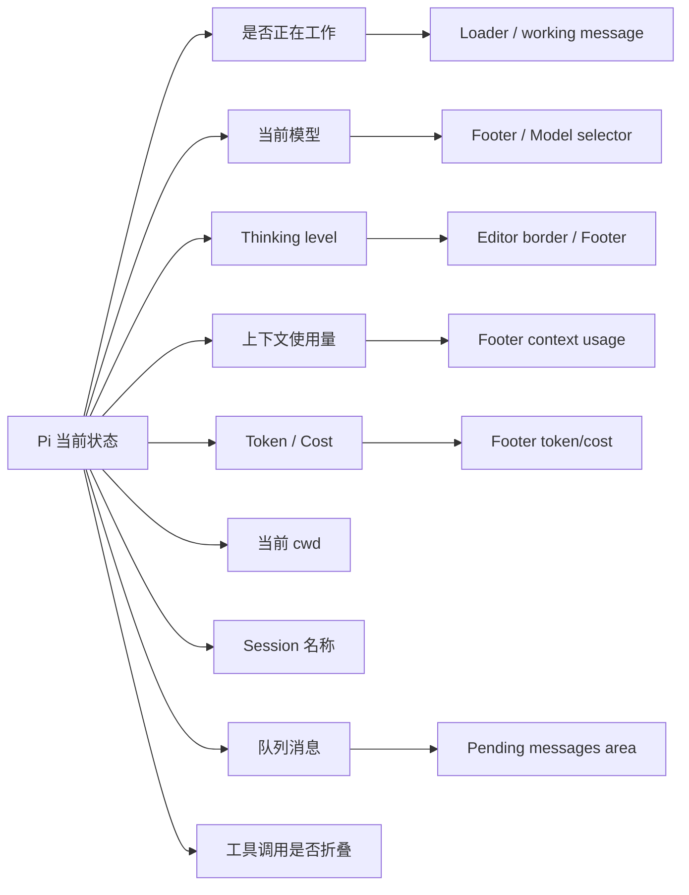

产品判断标准：用户应该随时知道“它在干什么、为什么卡住、下一步会做什么、我还能不能输入”。

## 11. 模式之间的产品边界

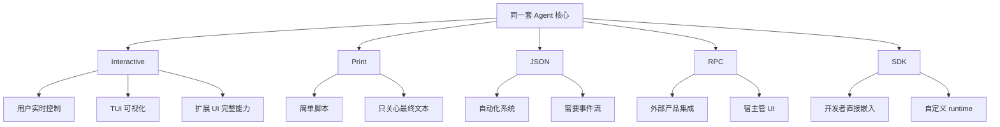

这意味着同一个底层能力可以包装成多个产品 SKU。

## 12. 产品机会点

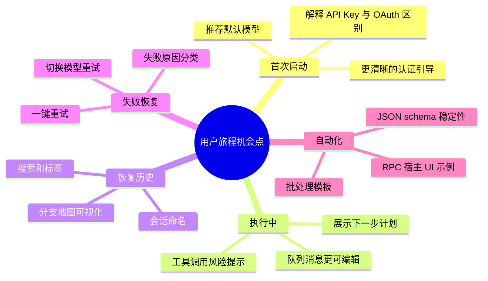

## 13. 小结

从用户旅程看，Pi 的关键产品体验不是“问答”，而是：

- 能进入真实项目。
- 能理解已有规则和历史。
- 能持续执行多步任务。
- 用户能中途纠偏。
- 工作过程能保存、恢复、分支和复用。

后续可以围绕“首次成功率、任务完成率、中途可控性、历史复用率、失败恢复率”设计产品指标。
