# 03 任务执行主循环

本文解释用户输入一句需求后，Pi 如何一步步变成真实操作：模型思考、调用工具、读取结果、继续推进，直到任务完成。

## 1. 一句话任务为什么会变成多步行动

用户通常只说目标，例如“帮我修这个 bug”。Pi 必须自己补齐中间步骤：

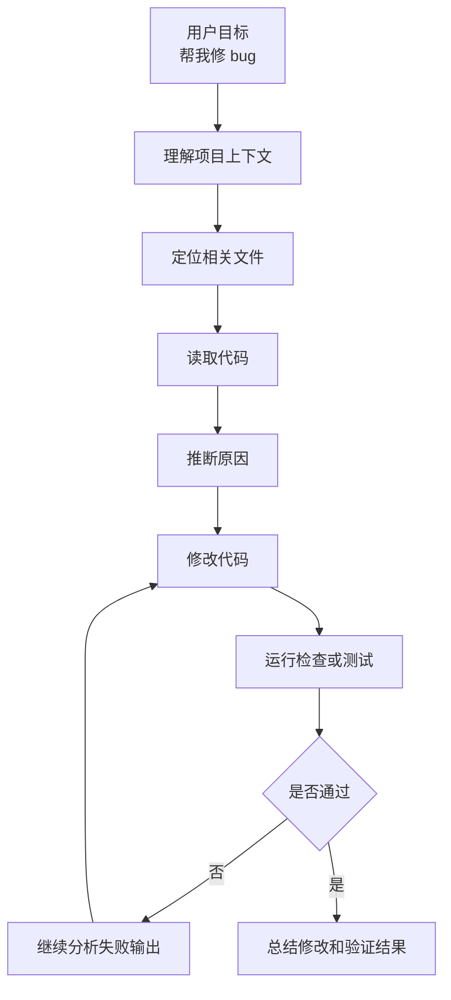

这个循环就是 Agent 的业务核心。

## 2. 主执行链路

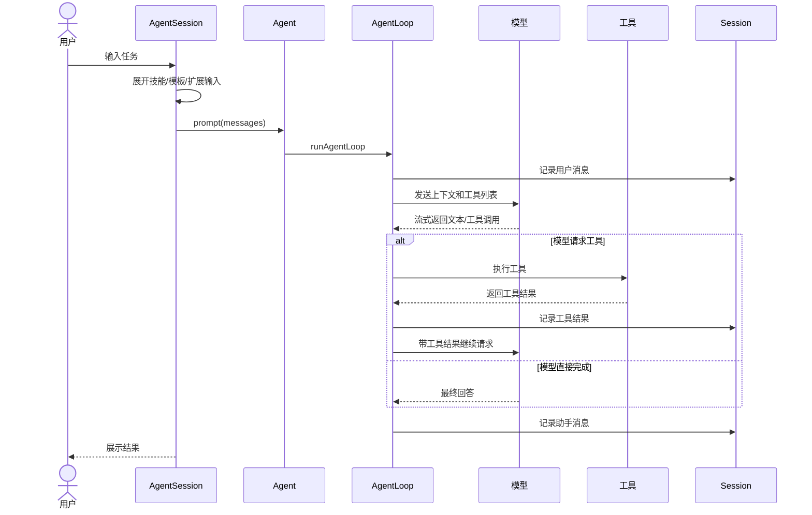

## 3. Agent 的状态变化

```mermaid
stateDiagram-v2
  [*] --> Idle: 等待用户
  Idle --> Preflight: 用户提交任务
  Preflight --> Streaming: 模型开始响应
  Streaming --> ToolRequested: 模型请求工具
  ToolRequested --> ToolRunning: 工具执行
  ToolRunning --> ToolResultReady: 工具返回结果
  ToolResultReady --> Streaming: 继续请求模型
  Streaming --> Completed: 无更多工具调用
  Streaming --> Error: 模型或请求失败
  ToolRunning --> Aborted: 用户中断
  Completed --> Idle: 保存并展示
  Error --> RetryWaiting: 满足自动重试条件
  RetryWaiting --> Streaming: 继续尝试
  Error --> Idle: 不再重试
  Aborted --> Idle: 恢复输入
```

用户在界面看到的是：

- 模型正在输出。
- 工具正在执行。
- 命令输出不断刷新。
- 工具结果可折叠/展开。
- 结束后回到可输入状态。

## 4. 消息如何进入模型

Pi 内部有一些消息只给 UI 或 session 用，不应该直接给模型。进入模型前会做转换。

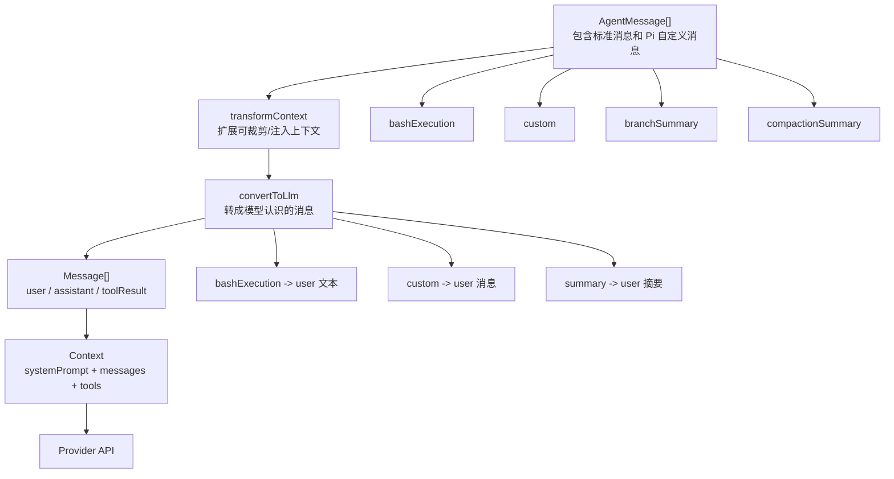

产品解释：

- 用户看到的“工作记录”和模型看到的“上下文”不是完全一样。
- Pi 会把工作记录整理成模型能理解的材料。
- 这让系统既能保存完整过程，又能控制模型输入质量。

## 5. 为什么需要系统提示词

系统提示词相当于“给模型的工作规则”。它由多种资源拼出来：

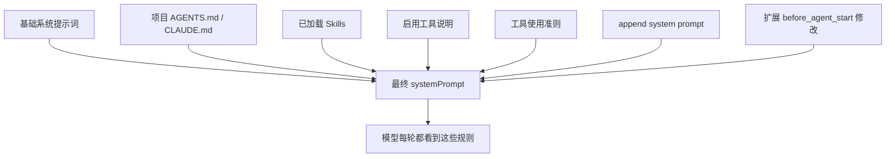

这就是为什么同样一句用户需求，在不同项目里 Pi 的行为会不同。

## 6. 工具调用循环

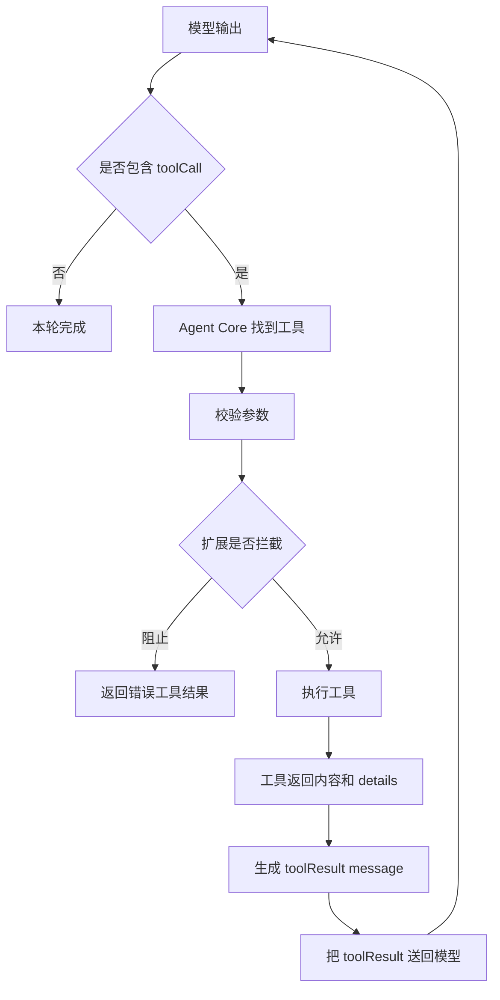

产品上可以理解为：模型不是直接操作电脑，而是“申请调用工具”，Agent 负责执行和记录。

## 7. 并行工具与顺序工具

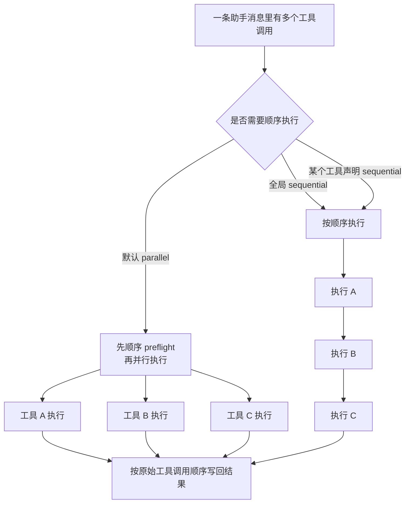

为什么产品要关心：

- 并行能提升速度。
- 顺序能降低冲突风险。
- 文件写入工具还会对同一文件加队列，避免同时写坏文件。

## 8. 中途纠偏如何插入

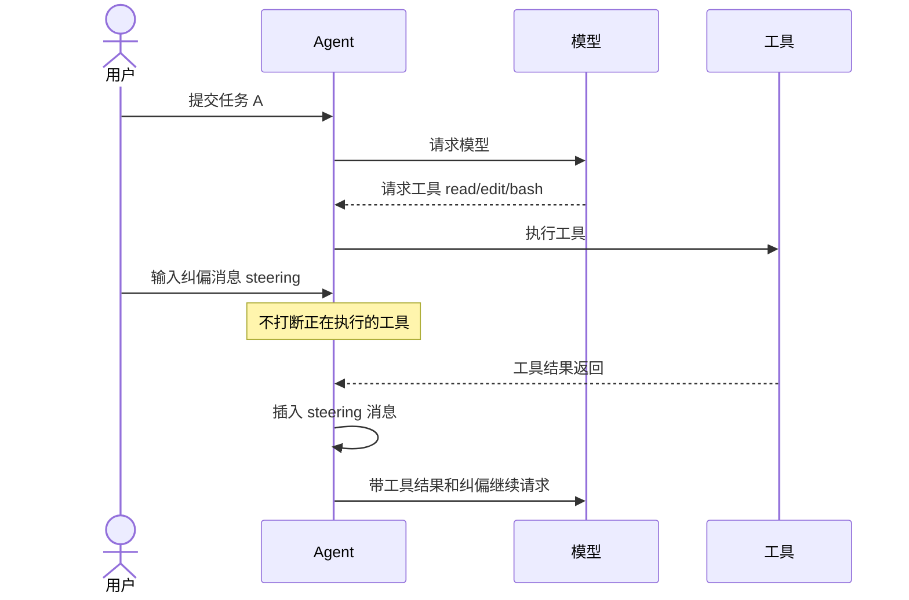

产品解释：

- Steering 不会粗暴打断正在跑的工具。
- 它会在安全边界插入下一轮上下文。
- 用户感知是“我说的话很快会被听到”。

## 9. Follow-up 如何排队

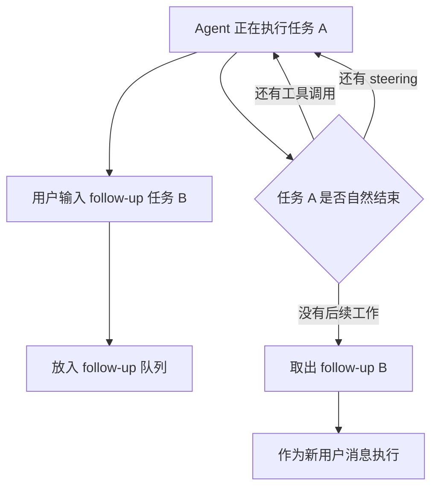

适合场景：

- “先修这个 bug，修完后再帮我写 changelog。”
- “你先跑完检查，之后总结风险。”

## 10. 失败处理路径

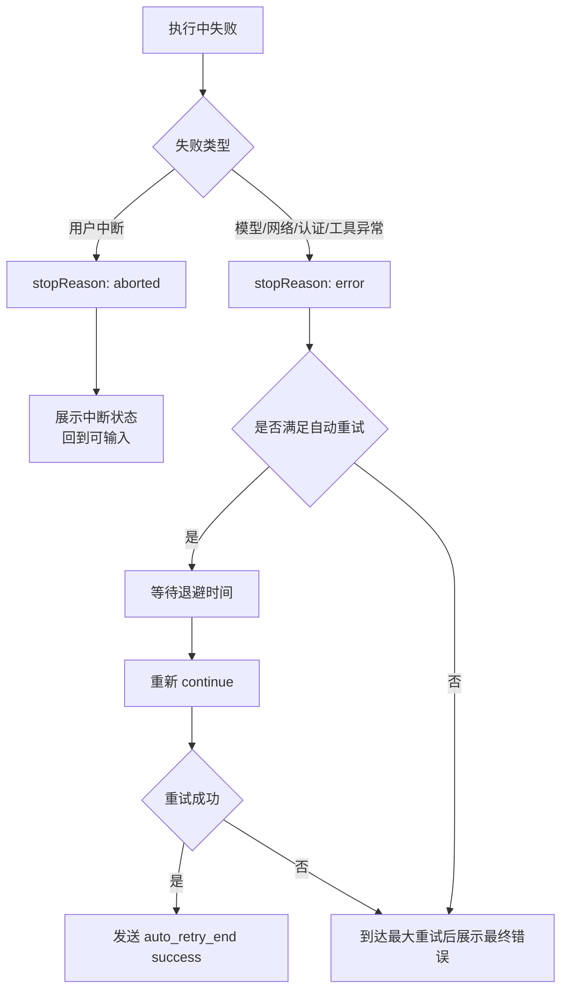

产品需要把失败信息讲清楚：

- 是认证问题？
- 是模型请求失败？
- 是工具执行失败？
- 是用户主动取消？
- 是否已经自动重试？

## 11. 从产品指标看任务执行

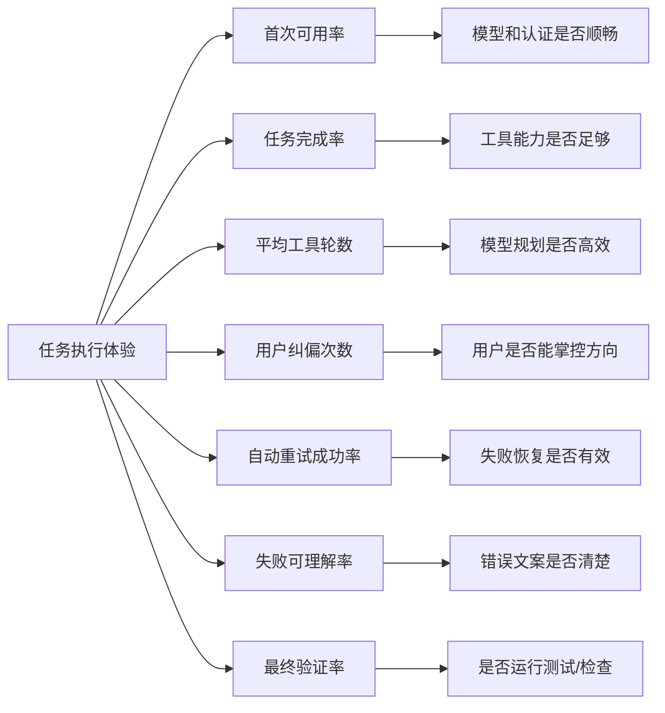

## 12. 小结

Pi 的任务执行不是“模型直接给答案”，而是：

1. 用户给目标。
2. 系统整理上下文和规则。
3. 模型决定下一步。
4. 工具执行真实动作。
5. 结果回到模型。
6. 多轮循环直到完成或失败。

产品设计要重点关注：用户能否理解当前状态、能否中途影响方向、失败时能否知道下一步。
