# 04 工具协作与结果呈现

本文解释 Pi 的工具体系如何把“模型的想法”变成“对项目的真实操作”。重点不是技术实现，而是用户能感知到哪些能力、风险和结果。

## 1. 工具在业务里的角色

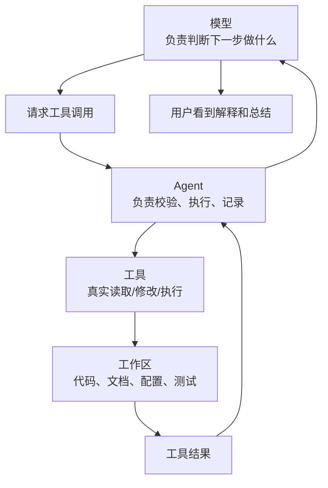

模型不是直接改文件。它提出工具请求，Agent 执行工具，再把结果返回给模型。

## 2. 内置工具能力地图

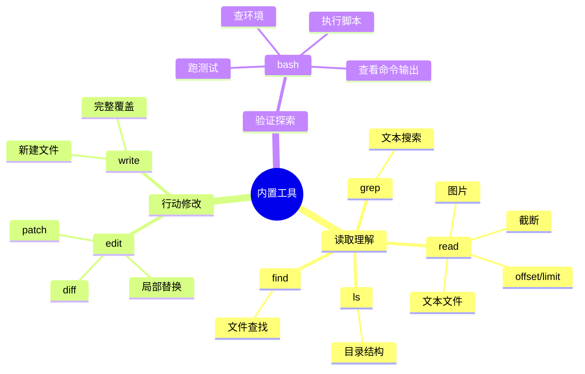

## 3. 工具选择逻辑

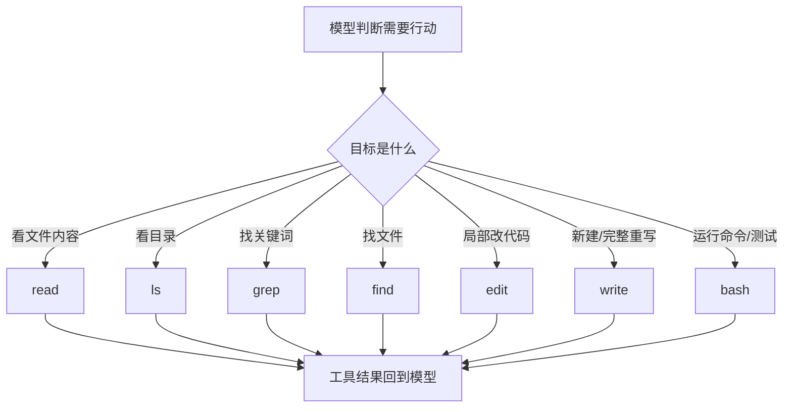

产品上可以把工具理解为 Agent 的“手脚”。模型是脑，工具是执行能力。

## 4. Read 工具旅程

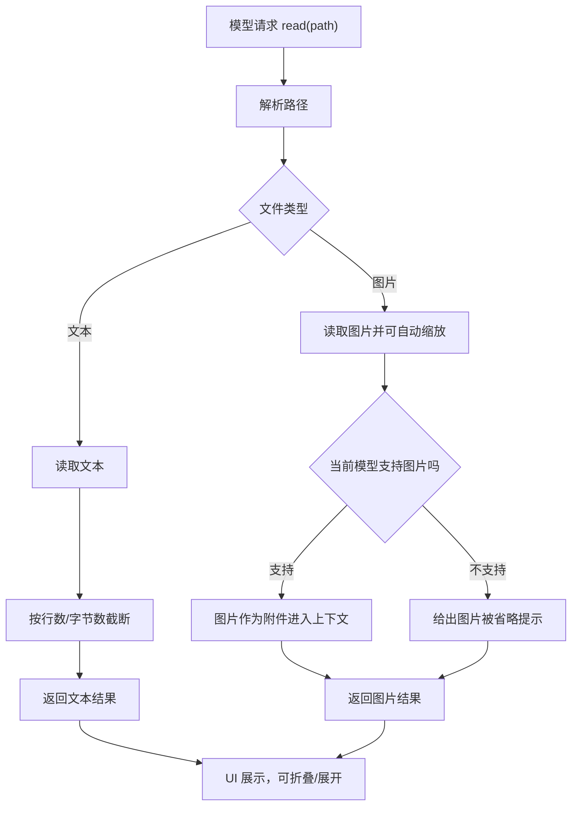

用户价值：

- 模型可以主动查项目文件。
- 大文件不会一次性塞爆上下文。
- 图片可参与理解，但会受模型能力影响。

## 5. Bash 工具旅程

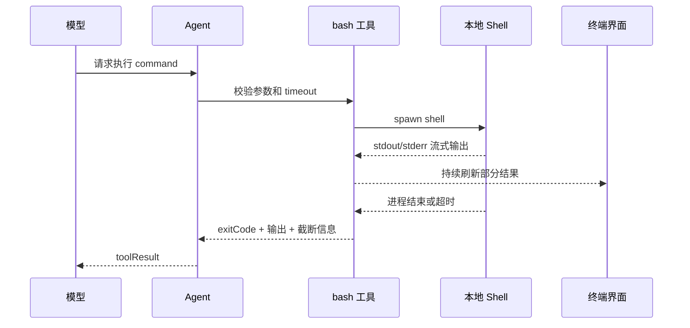

产品可见点：

- 命令不是黑盒，会流式显示。
- 超长输出会截断，但保留完整输出路径。
- 超时或用户中断会杀掉进程树。

## 6. Edit 与 Write 的区别

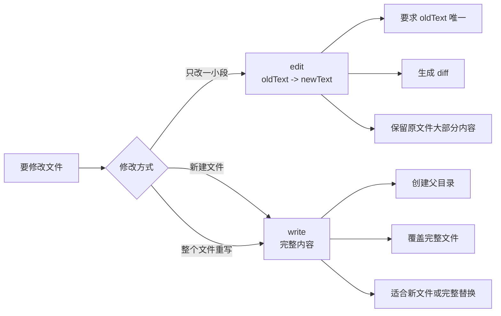

产品解释：

- `edit` 更适合低风险局部修改。
- `write` 更适合明确的新文件或完整重写。
- UI 应强调 diff，让用户知道改了哪里。

## 7. 文件写入防冲突

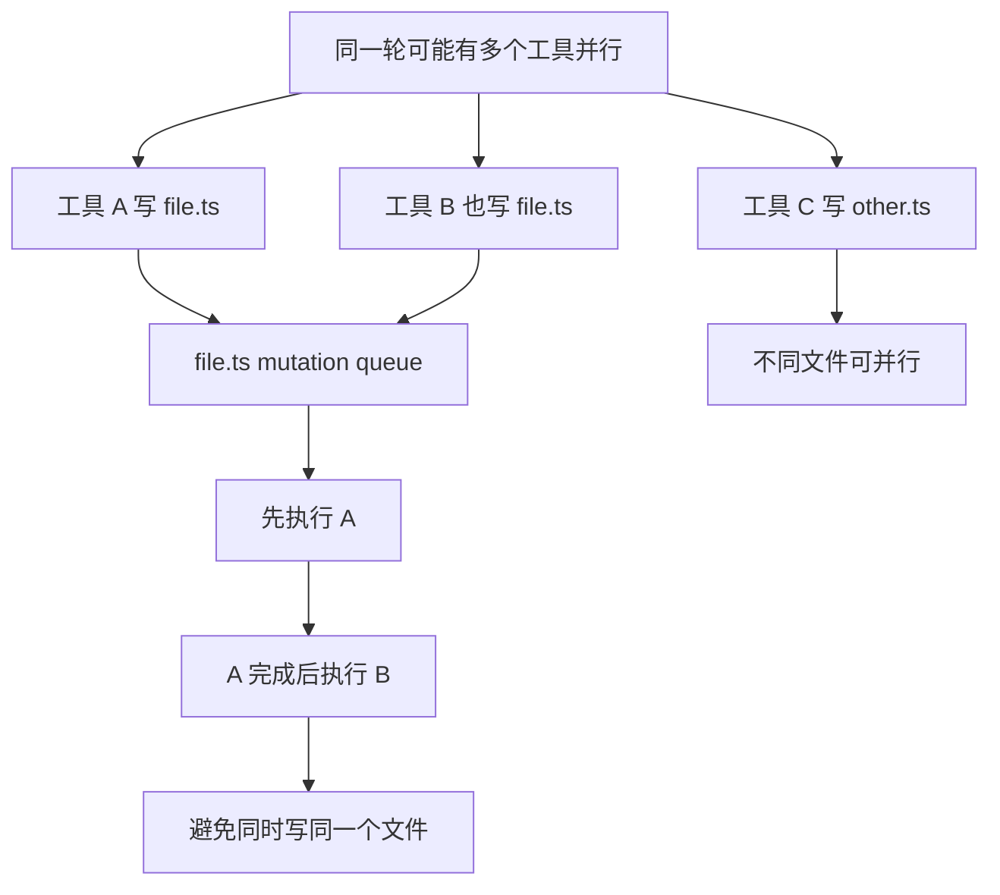

这是一个重要的业务安全设计：既追求速度，又避免同文件并发写坏。

## 8. 工具结果如何被用户理解

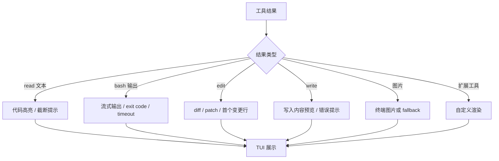

产品上最重要的是“工具结果可解释”。如果用户看不懂工具干了什么，就很难信任 Agent。

## 9. 工具执行状态

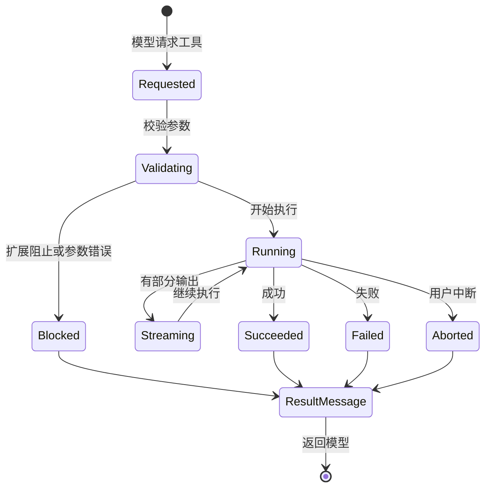

## 10. 产品风险和缓解

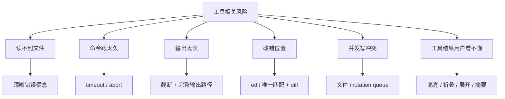

## 11. 工具与模型的关系

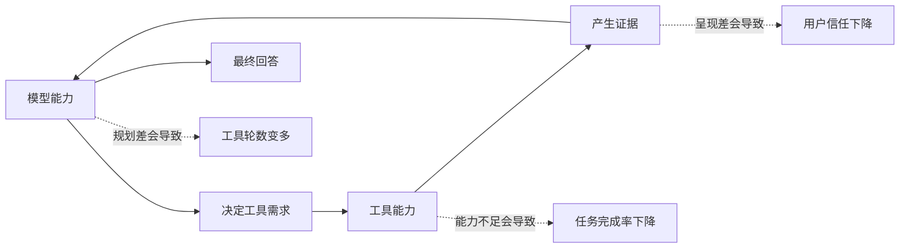

产品要同时看三件事：

- 工具够不够。
- 模型会不会用。
- 用户看不看得懂。

## 12. 可挖掘的工具体验方向

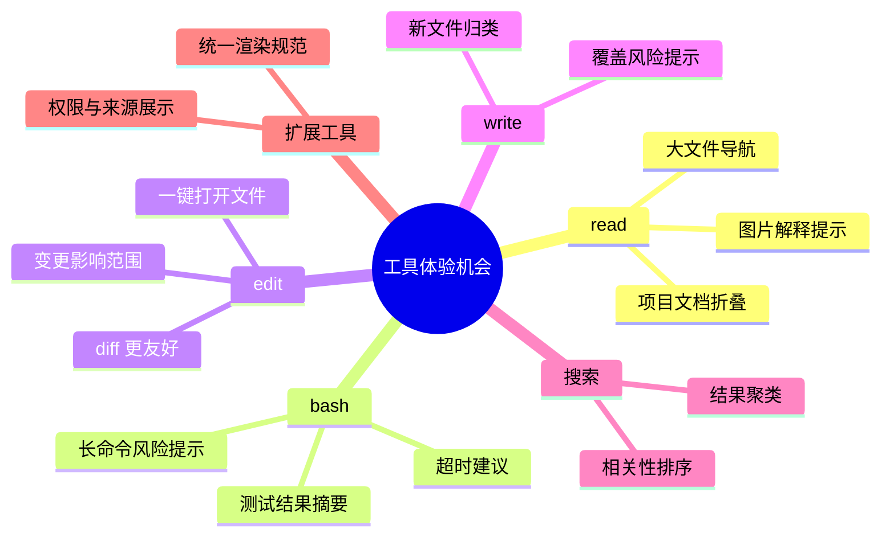

## 13. 小结

工具体系是 Pi 从“聊天机器人”变成“开发助手”的关键。产品上要关注：

- 工具调用是否透明。
- 风险是否可理解。
- 修改是否可追溯。
- 结果是否能被模型继续利用。
- 用户是否能看懂工具帮自己做了什么。
