# 05 会话资产、分支与压缩

本文解释 Pi 为什么把一次开发过程当成“资产”保存，以及 resume、tree、fork、compact 等能力在业务上解决什么问题。

## 1. 会话是什么

会话不是普通聊天记录，而是一份完整工作日志：

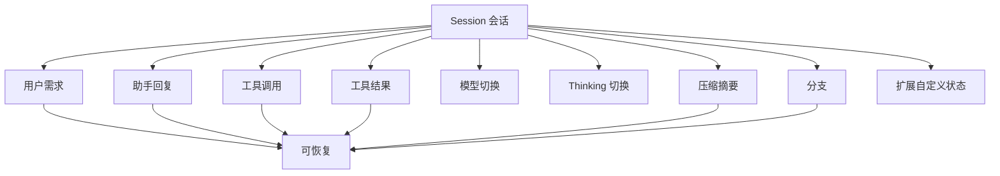

产品语言：会话是“用户和 Pi 一起完成任务的过程资产”。

## 2. 为什么需要会话资产

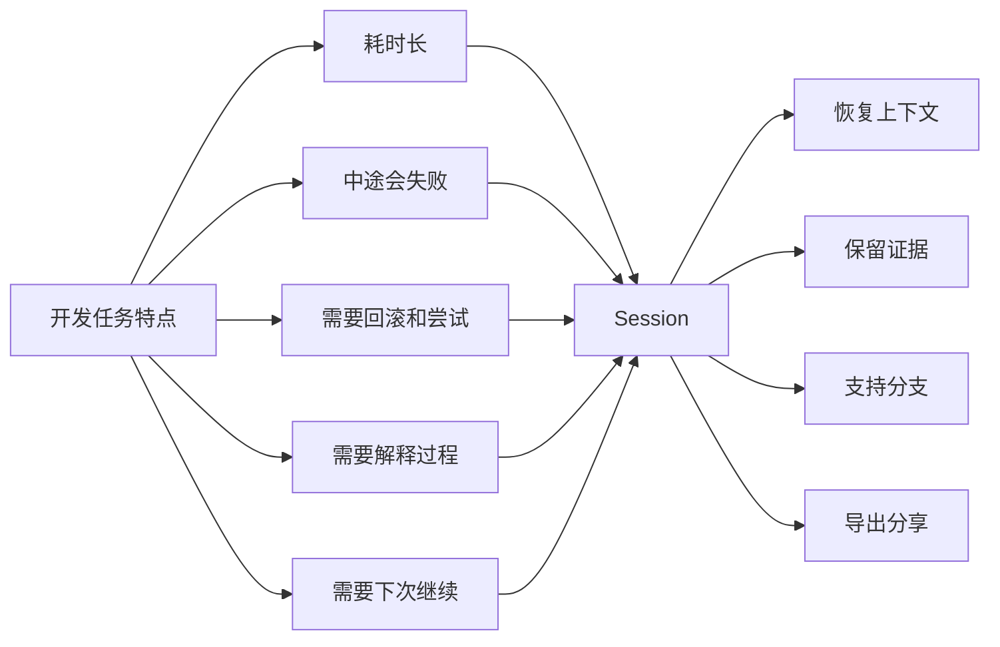

如果没有会话，用户每次都要重新解释背景，Agent 的工作也无法审计。

## 3. 会话生命周期

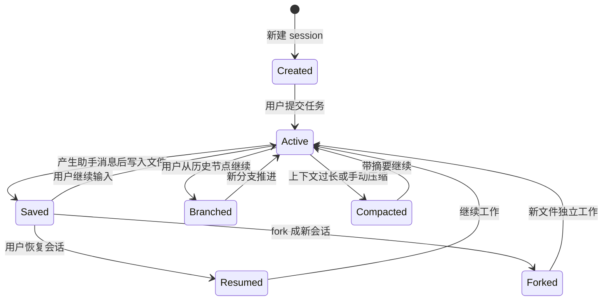

## 4. 会话如何保存

Pi 使用 append-only JSONL。可以理解成“每发生一件事，就往日志末尾加一条记录”。

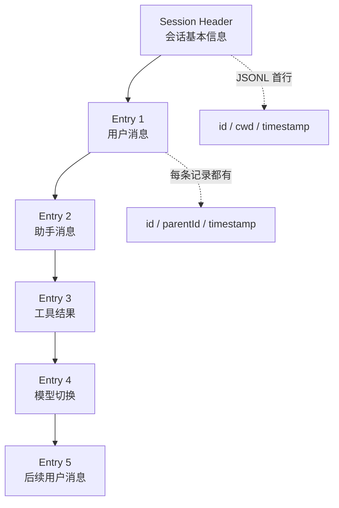

append-only 的产品好处：

- 历史不被覆盖。
- 方便审计。
- 分支可以自然存在。
- 扩展可以追加自己的状态。

## 5. 树形历史

普通聊天是线性的，但 Pi 的会话是树。

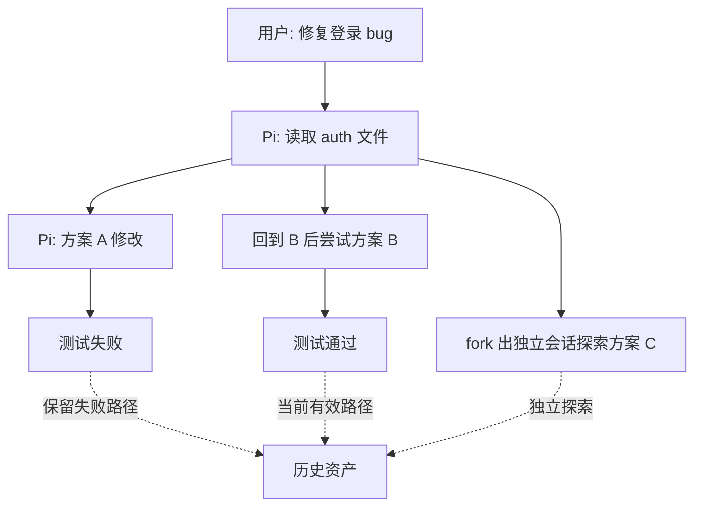

这让用户可以：

- 回到某个历史节点重新开始。
- 保留失败尝试作为知识。
- 对比不同方案。
- 把某条路径 fork 成新会话。

## 6. Tree 功能的业务含义

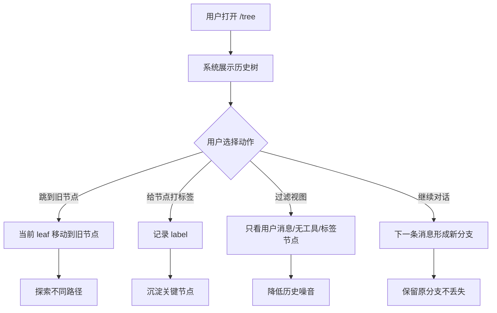

产品机会：

- 标签可以变成“里程碑”。
- 过滤可以帮助用户快速找到关键决策点。
- 分支可视化是高级用户理解 Agent 工作的核心。

## 7. Resume 逻辑

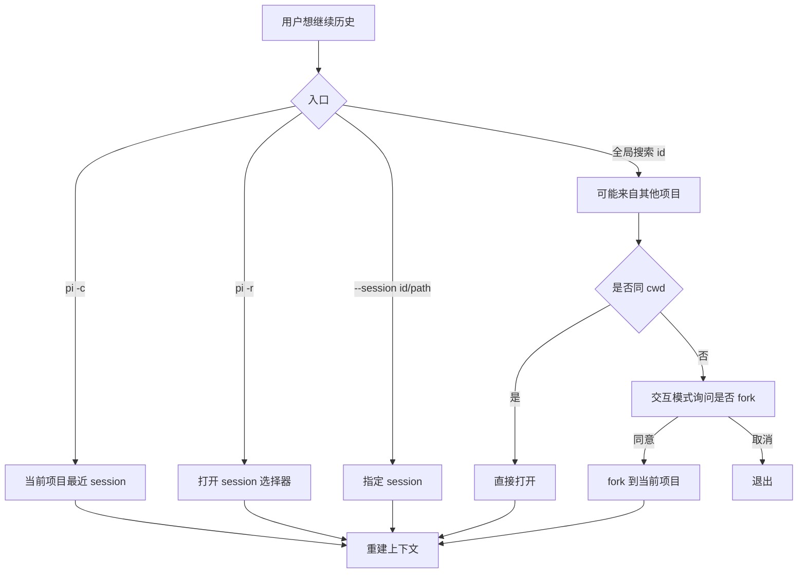

为什么跨项目 session 要谨慎：

- 工作目录不同，文件路径可能失效。
- 项目 settings 和资源不同。
- 直接继续可能误操作另一个项目。

## 8. Fork 与 Clone

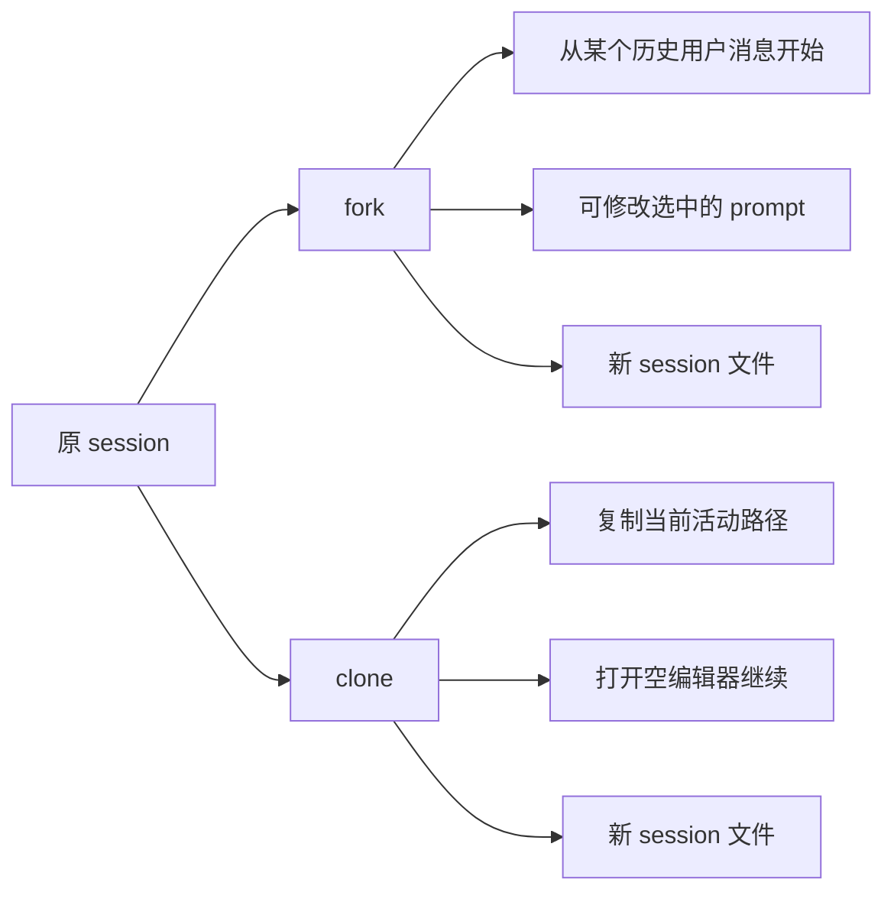

产品区别：

- Fork 更像“从历史某个需求重新提问”。
- Clone 更像“把当前成功路径复制一份继续干别的”。

## 9. Compact 为什么存在

模型有上下文窗口限制。会话越长，能塞进模型的历史越多，但也越贵、越容易超限。

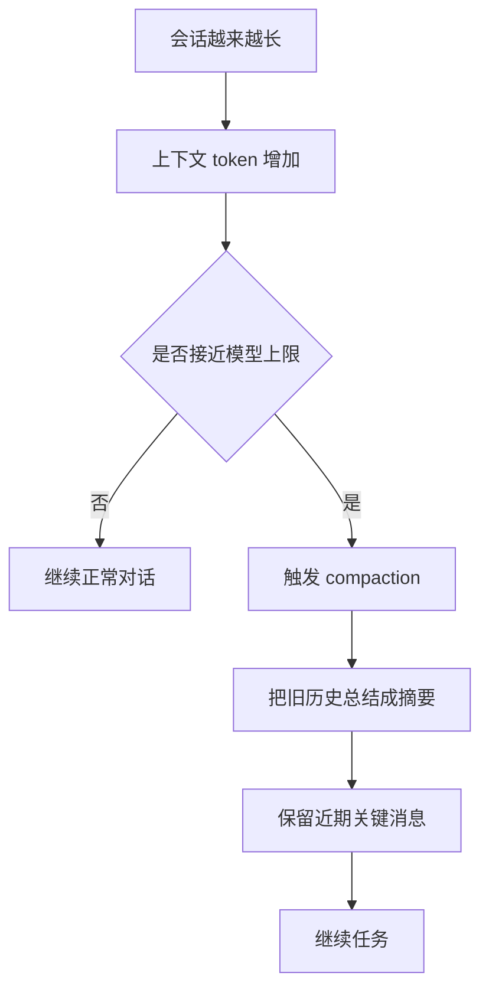

Compact 的产品含义：

- 不是删除历史。
- 是把“模型需要看的旧内容”压缩成摘要。
- 原始 JSONL 仍保留完整记录。

## 10. Compact 后上下文怎么变

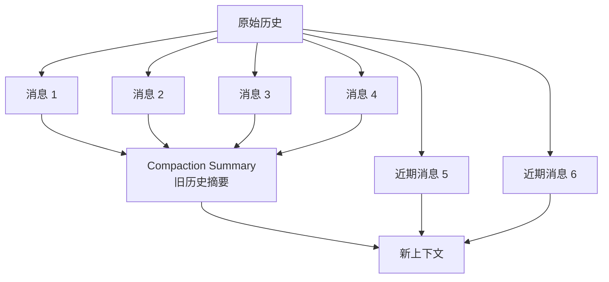

用户看到的是会话还在继续；模型看到的是“摘要 + 近期原文”。

## 11. 导出和分享

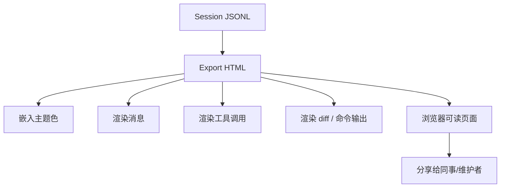

导出适合：

- 复盘 Agent 做了什么。
- 在 issue/PR 中解释过程。
- 分享给团队做案例学习。
- 作为 OSS session 数据集材料。

## 12. 会话资产的产品指标

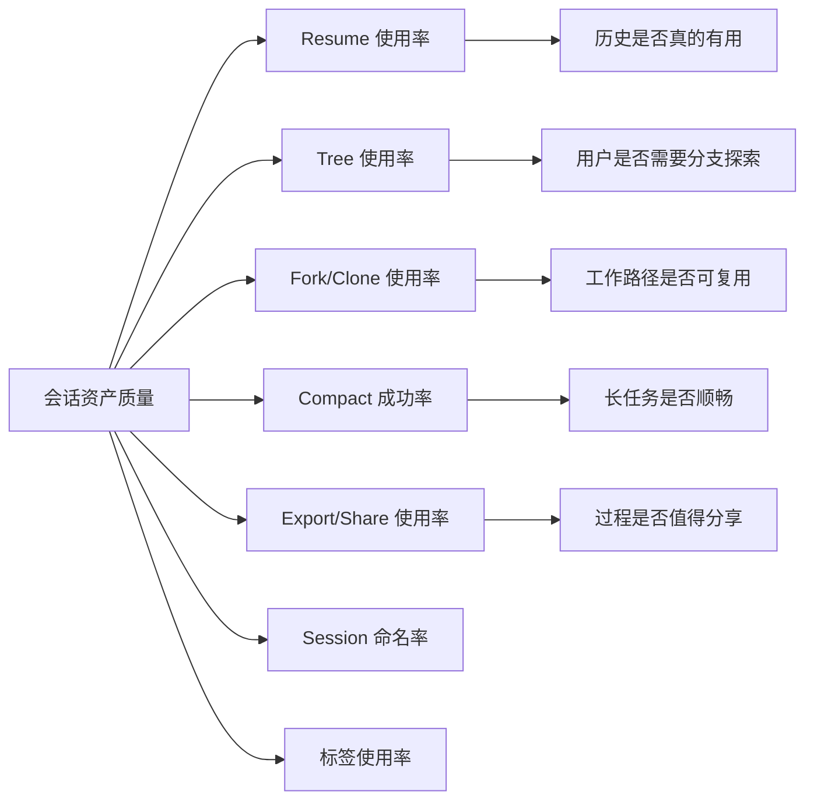

## 13. 机会点

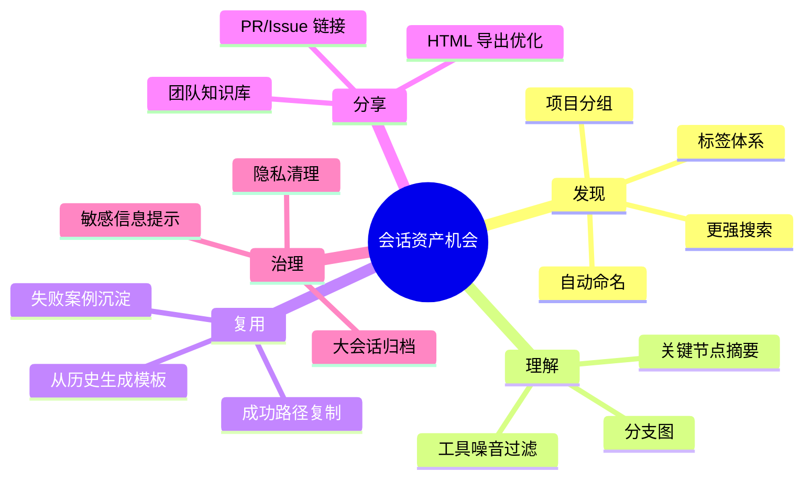

## 14. 小结

Pi 的会话系统把开发过程变成可恢复、可分支、可压缩、可分享的资产。对产品来说，最值得关注的是：

- 用户如何找到历史。
- 用户如何理解分支。
- 长任务如何不丢上下文。
- 成功经验如何被复用。
- 分享出去的过程是否清楚可信。
