# 06 模型、认证、成本与失败处理

本文解释 Pi 如何选择模型、处理认证、控制 thinking level，并把模型请求失败转化为用户能理解的状态。

## 1. 模型在业务里的位置

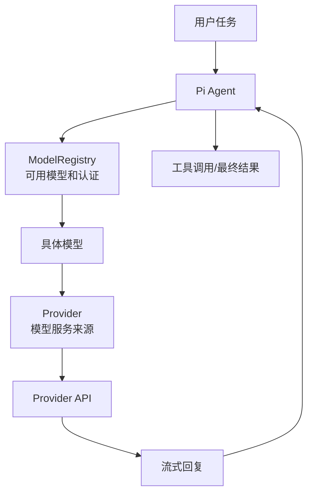

模型负责理解和决策，但 Pi 负责：

- 找到可用模型。
- 给请求加认证。
- 把不同 Provider 的协议统一。
- 展示成本、上下文、thinking 等状态。

## 2. Provider、Model、API 的关系

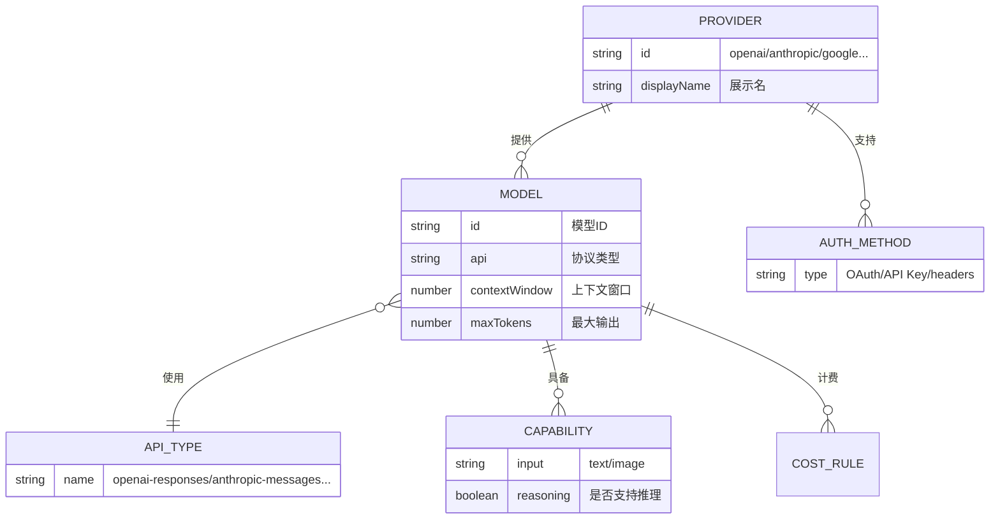

产品解释：

- Provider 是“厂商或服务入口”。
- Model 是“具体可选的大脑”。
- API 是“Pi 和这个模型说话的协议”。
- Auth 是“能否使用这个服务的凭证”。

## 3. 模型来源

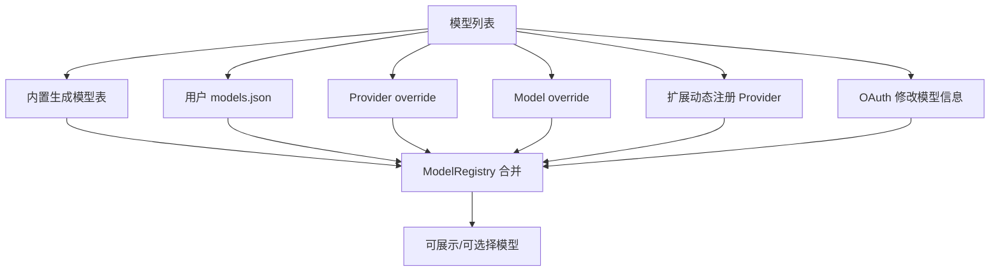

这意味着产品上模型不是固定列表，而是可由用户和扩展动态改变。

## 4. 认证来源

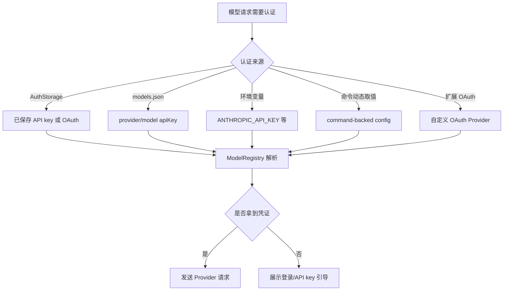

## 5. 用户登录旅程

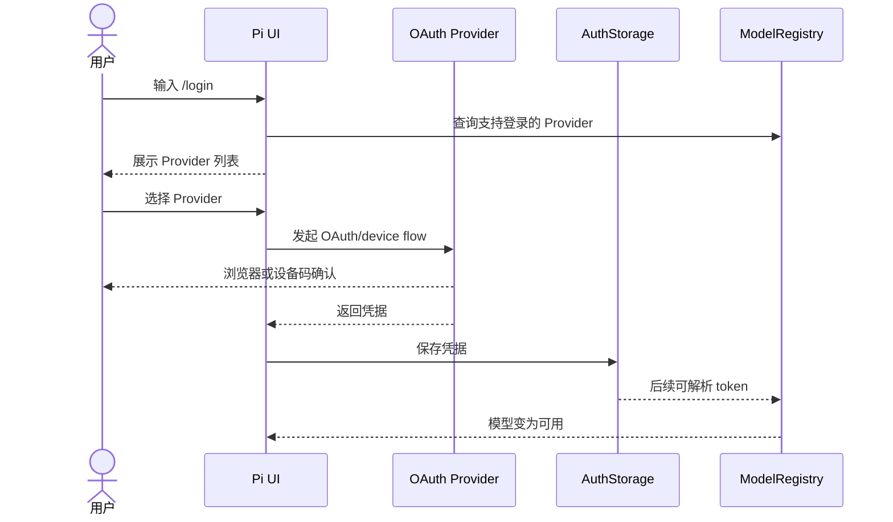

产品关键点：

- 登录成功后，用户应该立即知道哪些模型变可用了。
- 订阅登录和 API key 使用成本可能不同，文案要明确。

## 6. 模型选择流程

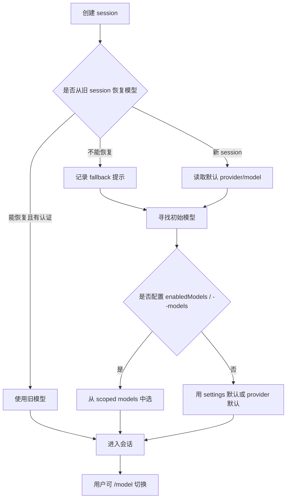

## 7. Scoped Models 的业务含义

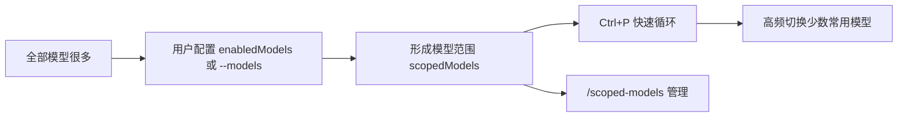

产品解释：

- 全部模型列表适合搜索。
- scoped models 适合日常快速切换。
- thinking level 也可以跟随 scoped model pattern。

## 8. Thinking Level

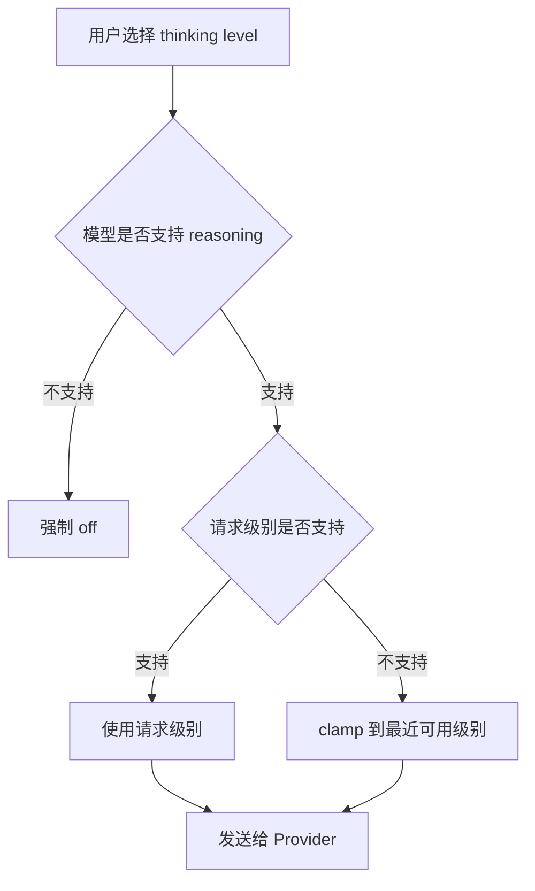

产品解释：

- Thinking level 是用户对“模型思考强度”的控制。
- 不是所有模型都支持。
- `xhigh` 只有部分模型支持。
- UI 需要告诉用户实际生效的级别，而不只是用户请求的级别。

## 9. 上下文与成本

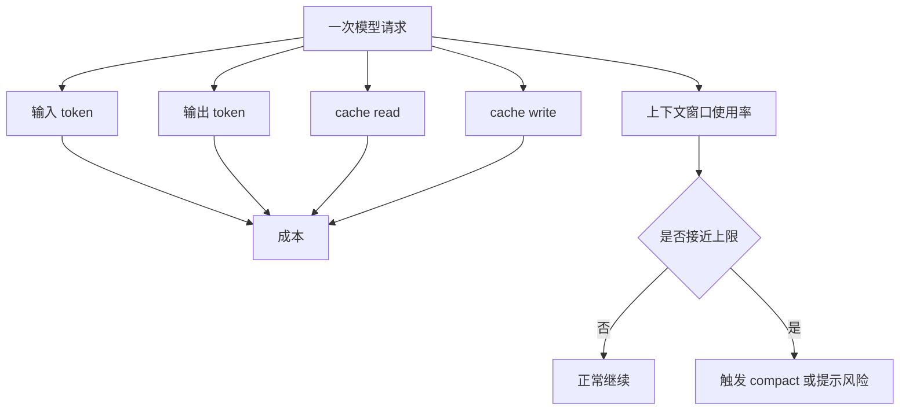

产品上，footer 里的 token/cost/context 不是技术噪音，而是用户掌控感来源。

## 10. Provider 请求链路

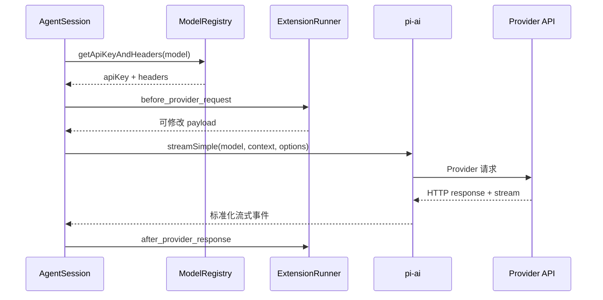

## 11. 失败类型

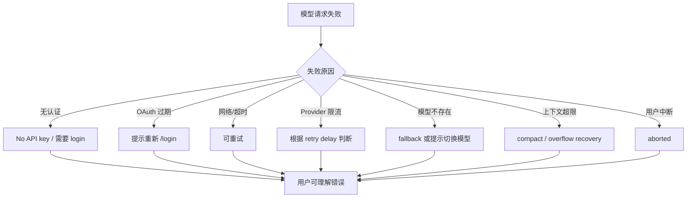

## 12. 自动重试

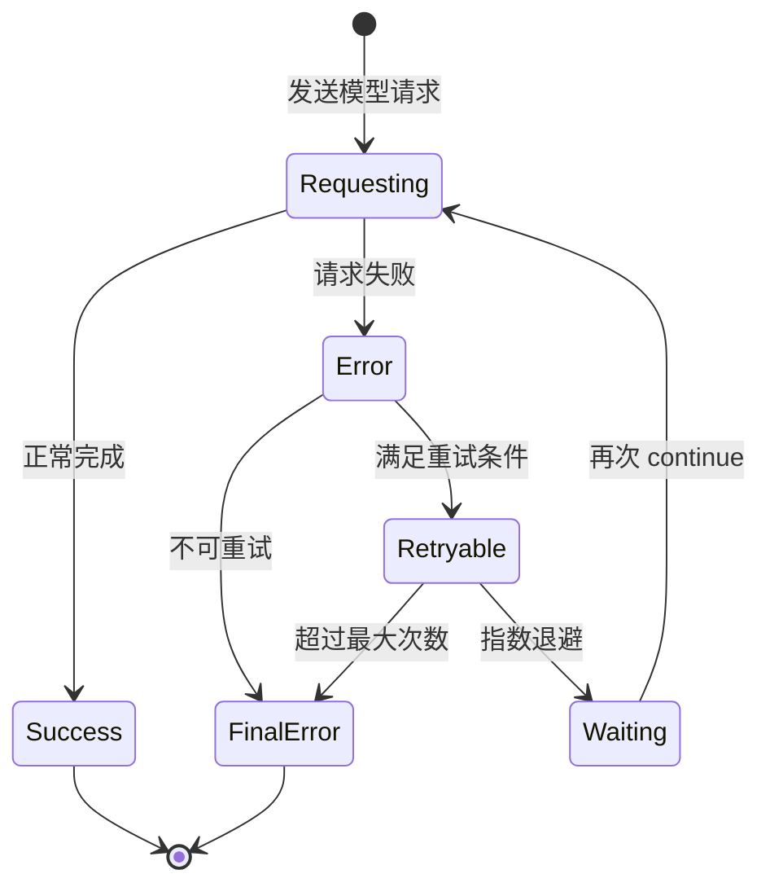

产品重点：

- 自动重试不应该让用户困惑。
- UI 应说明“正在重试第几次”。
- 最终失败要说明重试已经结束。

## 13. 模型产品机会点

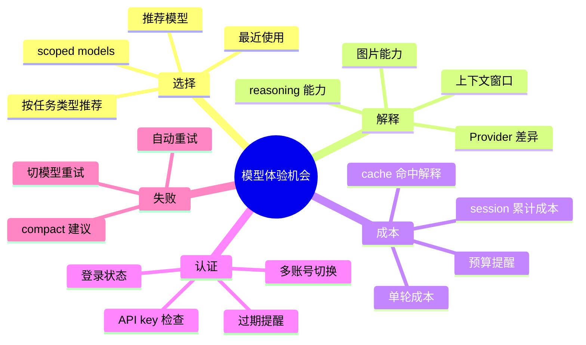

## 14. 小结

模型系统对产品的影响非常大：

- 决定任务能力上限。
- 决定用户是否能成功启动。
- 决定速度、成本、上下文长度。
- 决定失败恢复体验。

产品上要避免把“模型选择”和“认证配置”做成纯技术设置，它们实际是核心用户旅程的一部分。
