# 07 扩展生态与终端体验

本文解释 Pi 如何通过资源和扩展变成一个可定制平台，以及终端 UI 如何承载这些能力。

## 1. 为什么需要扩展生态

不同团队的开发流程差异很大：

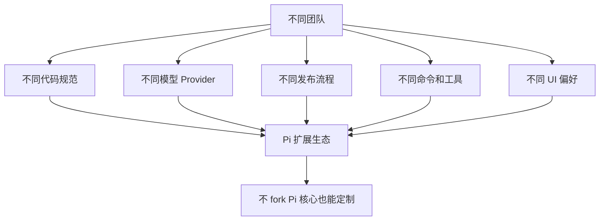

产品定位：Pi 不只是一个固定 CLI，而是一个可被团队塑形的 agent harness。

## 2. 资源类型

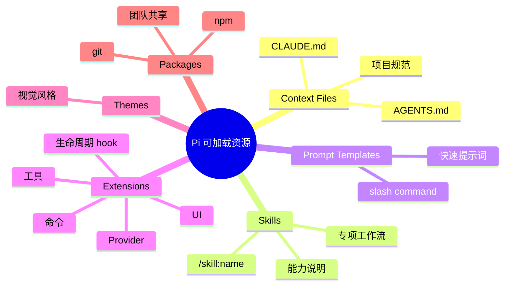

## 3. 资源加载链路

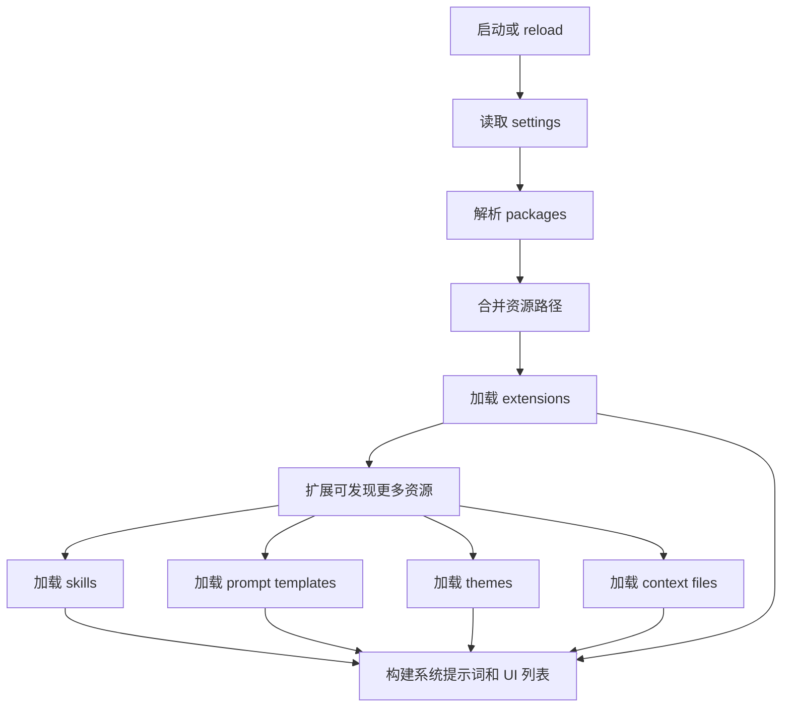

## 4. 资源来源优先级

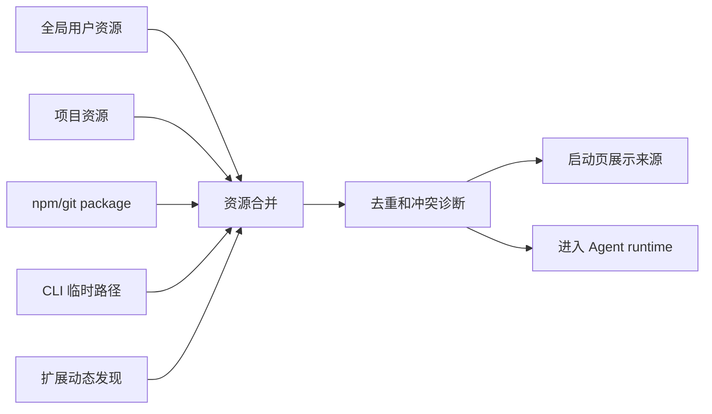

产品上 sourceInfo 很重要：用户需要知道某条规则、某个技能、某个命令来自哪里。

## 5. Extension 能做什么

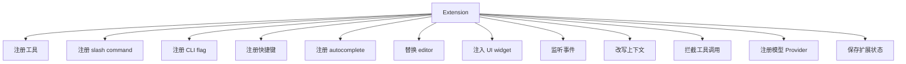

这使扩展既能改变“Agent 怎么想”，也能改变“用户怎么操作”。

## 6. 生命周期 hook

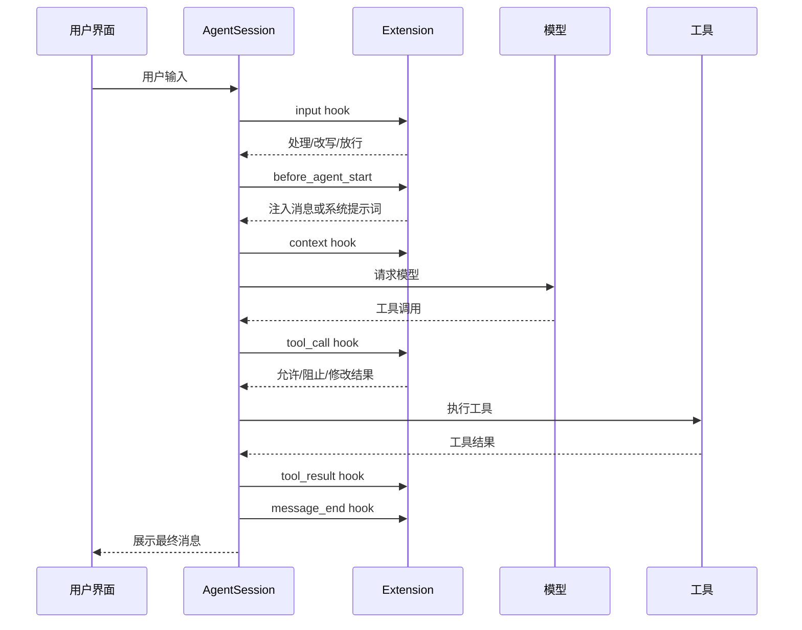

## 7. 扩展 UI 能力

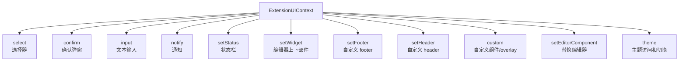

这意味着扩展不仅是后台逻辑，也可以提供完整交互。

## 8. 交互式 TUI 布局

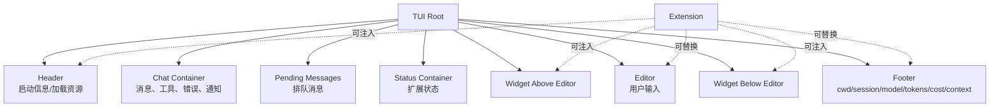

## 9. 终端界面状态反馈

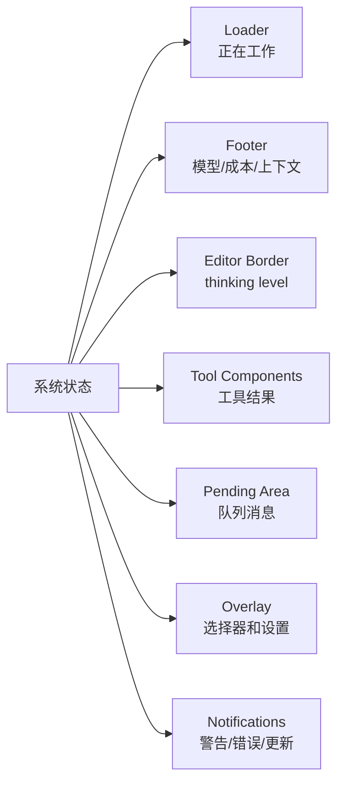

对于非技术用户，状态反馈决定信任感。

## 10. RPC 模式下的扩展 UI

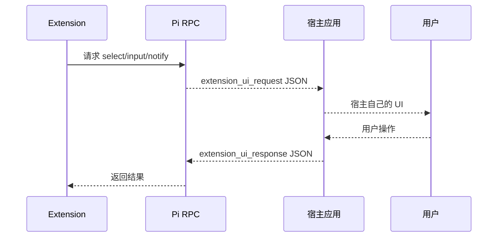

产品意义：

- Interactive 模式由 Pi 自己画 UI。
- RPC 模式由宿主产品画 UI。
- 扩展可以复用同一套逻辑，但 UI 交给不同外壳承载。

## 11. Packages 的业务价值

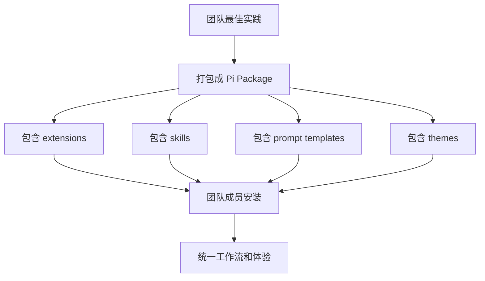

Packages 让团队可以共享：

- 代码审查流程。
- 发布流程。
- 内部工具。
- 自定义 Provider。
- 品牌主题。
- 项目规范。

## 12. 冲突和诊断

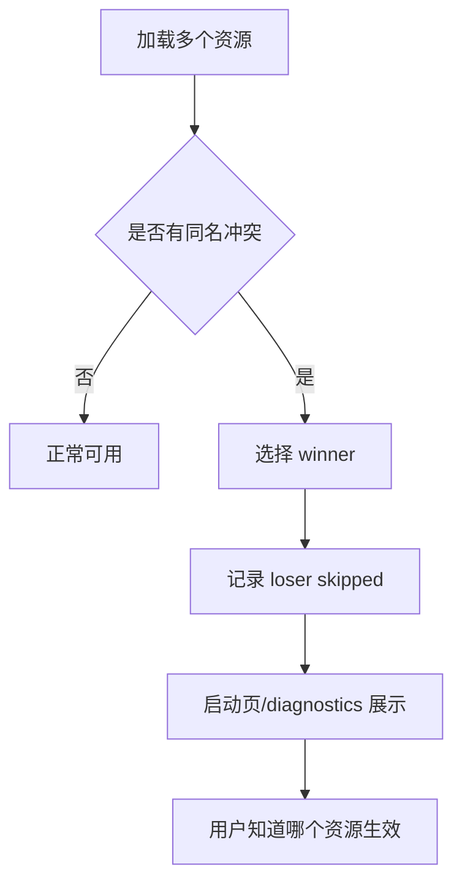

冲突透明对扩展生态很重要，否则用户会疑惑“为什么我的命令没有生效”。

## 13. 主题和视觉体验

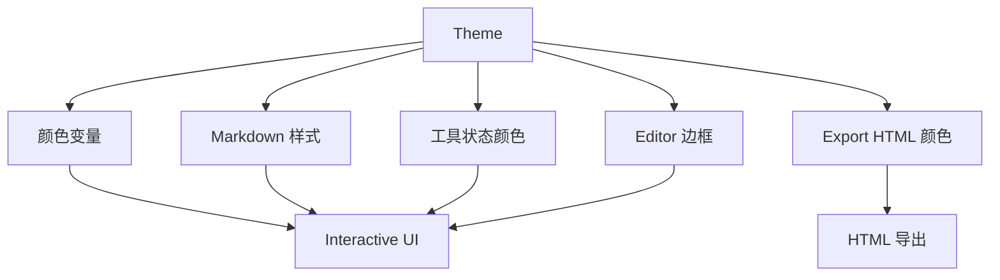

主题不是装饰，它影响：

- 错误是否醒目。
- 工具成功/失败是否清楚。
- 长会话阅读疲劳。
- 导出内容是否适合分享。

## 14. 生态产品机会

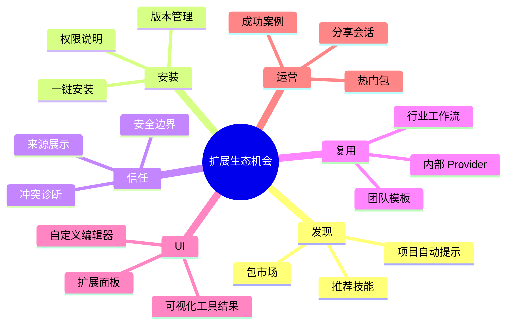

## 15. 平台化路径

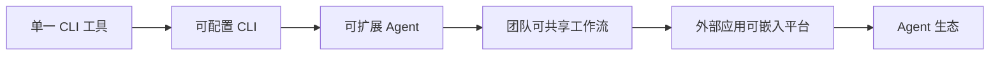

Pi 的扩展和 RPC/SDK 能力，让它有从工具走向平台的空间。

## 16. 小结

扩展生态和 TUI 是 Pi 的产品杠杆：

- 资源让 Pi 理解团队规则。
- 扩展让 Pi 拥有团队特定能力。
- TUI 让复杂过程可见、可控。
- RPC/SDK 让 Pi 能被其他产品复用。

对产品经理来说，后续最值得关注的是：扩展如何被发现、安装、信任、调试和分享。
