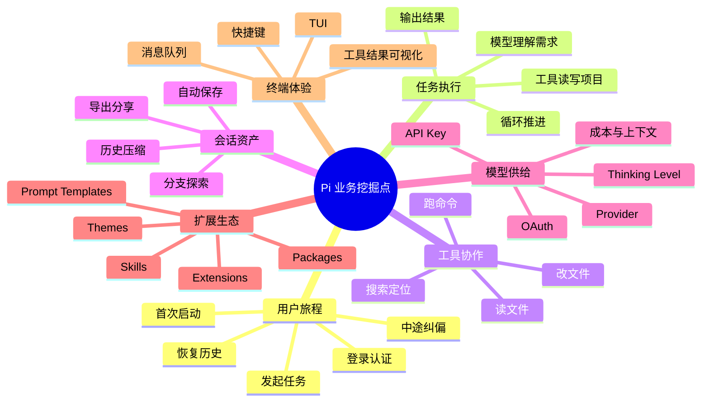
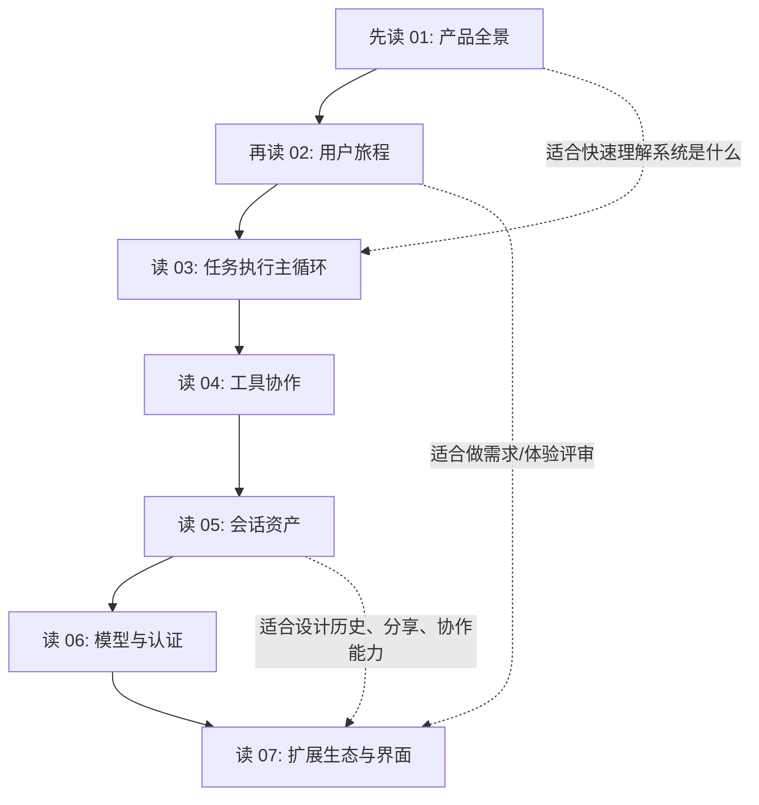
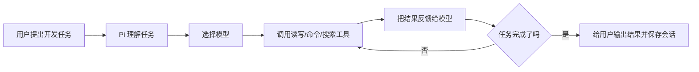

# Pi 业务逻辑可视化说明文档

本文档集面向不懂技术的产品经理、设计、运营和业务同学。它不要求读者理解源码，而是把 Pi 这个终端 coding agent 拆成“用户、任务、工具、会话、模型、扩展、界面”几条业务主线，用 Mermaid 图表说明业务如何流转。

## 你应该重点挖掘什么

Pi 表面上是一个命令行工具，但业务上更像一个“可持续工作的开发助手平台”。值得深入挖掘的点有 7 类：

## 推荐阅读顺序

## 文档列表

- [01 产品全景与业务对象](01-product-map.md)
- [02 用户旅程与模式选择](02-user-journey.md)
- [03 任务执行主循环](03-task-execution.md)
- [04 工具协作与结果呈现](04-tools-workflow.md)
- [05 会话资产、分支与压缩](05-session-memory.md)
- [06 模型、认证、成本与失败处理](06-model-auth-cost.md)
- [07 扩展生态与终端体验](07-extension-ui-ecosystem.md)

## 一句话理解 Pi

Pi 的核心价值不是“回答问题”，而是“在真实项目目录中持续行动，并把过程沉淀成可恢复、可分支、可扩展的工作会话”。
